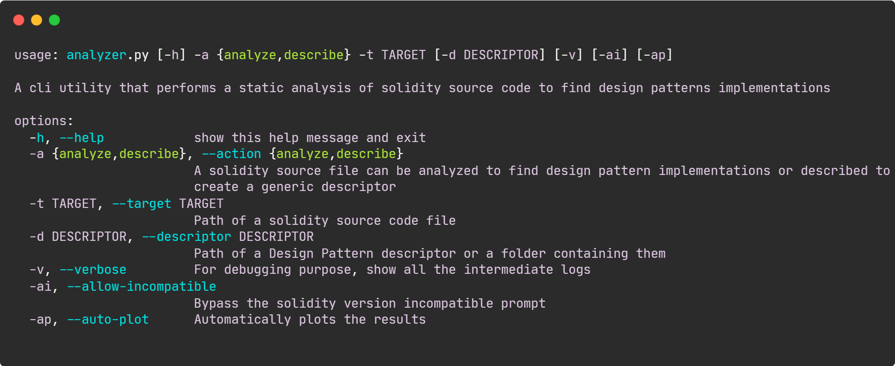

<a name="readme-top"></a>

<br />
<div align="center">
  <a href="https://github.com/LightDestory/SolidityDesignPatternAnalyzer">
    
  </a>
<h3 align="center">Solidity Design Pattern Analyzer</h3>

  <p align="center">
    A tool for design pattern recognition on blockchain through static code analysis
    <br />
    <br />
    This README is available in the following languages:
    <br />
    <a href="README.md">Italian</a>
    ·
    English
</div>

<details>
  <summary>Table of Contents</summary>
  <ol>
    <li>
      <a href="#about-the-project">About The Project</a>
      <ul>
        <li><a href="#built-with">Built With</a></li>
      </ul>
    </li>
    <li>
      <a href="#getting-started">Getting Started</a>
      <ul>
        <li><a href="#prerequisites">Prerequisites</a></li>
        <li><a href="#usage">Usage</a></li>
      </ul>
    </li>
    <li><a href="#license">License</a></li>
    <li><a href="#bibliography">Bibliography</a></li>
  </ol>
</details>


<!-- ABOUT THE PROJECT -->
## About The Project

Solidity Design Pattern Analyzer is a software application developed for my thesis for the Bachelor's Degree in Computer Science at the University of Catania.

The software application is capable of performing the following tasks:
- Detect, within the limits of the language and dependencies used, all twenty-two design patterns documented in the thesis, whose related descriptors are included in the source code, and it is possible, through the combination of generic checks, to define new descriptors to recognize future design patterns;
- Describing a smart-contract, i.e., extracting information useful for creating a
new descriptor;

<p align="right">(<a href="#readme-top">back to top</a>)</p>


### Built With

* [Python](https://www.python.org/)
* [python-solidity-parser](https://github.com/ConsenSys/python-solidity-parser)
* [python-jsonschema](https://github.com/python-jsonschema/jsonschema)
* [matplotlib](https://github.com/matplotlib/matplotlib)

<p align="right">(<a href="#readme-top">back to top</a>)</p>


## Getting Started

Dependencies must be installed before using the application.

### Prerequisites

To install dependencies you must use python's package installer named _pip_:
* As global packages:
  ```sh
  pip install -r requirements.txt
  ```
* Via virtual environment:
  ```sh
  python3 -m venv /path/to/new/virtual/environment
  source /path/to/new/virtual/environment/bin/activate
  pip install -r requirements.txt
  ```

### Usage

To use Analyzer it is necessary to provide a number of parameters, listed here:
| Parameter | Description |
| --------- | ---------------------------------------------------------------------------------------------- |
|`-h, --help` | An optional parameter that, if provided, will cause a guide on how to use it to be printed in the terminal |
|`-a, --action` | A mandatory parameter that accepts only the values `analyze` and `describe`, depending on the operation to be performed. |
|`-t, --target` | A mandatory parameter representing the path, absolute or relative, to the file containing some Solidity source code. |
|`-d, --descriptor` | A mandatory parameter for the `analyze` operation that represents the path, absolute or relative, of the file or folder containing the `Design Pattern Descriptors`. If omitted a default path will be used. |
|`-v, --verbose` | An optional parameter that, if supplied, will cause debug logs, not normally displayed, to be printed in the terminal. |
|`-ai, --allow-incompatible` | An optional parameter that, if supplied, will cause the compatibility check of the version of Solidity used in the supplied file to be ignored. |
|`-ap, --auto-plot` | An optional parameter that, if supplied, will make the graph of design pattern search results display au- tomatically. |

For example, wanting to analyze a smart-contract in order to detect the use of the Ownership pattern, it is necessary to execute the command:

  ```sh
  python analyzer.py -a analyze -t ./source_code.sol -d ./Ownership_descriptor.json
  ```

<p align="right">(<a href="#readme-top">back to top</a>)</p>


## License

This software is distributed under the MIT License. See `LICENSE` for more information.

<p align="right">(<a href="#readme-top">back to top</a>)</p>

## Bibliography

- [What is Ethereum?](https://ethereum.org/it/what-is-ethereum/)
- [Solidity Documentation.](https://docs.soliditylang.org/)
- [The official home of the Python Programming Language.](https://www.python.org/)
- [ANother Tool for Language Recognition.](https://www.antlr.org/)
- [An experimental Solidity parser for Python built on top of a robust ANTLR4 grammar.](https://github.com/ConsenSys/ python-solidity-parser)
- [JSON Schema — The home of JSON Schema.](https://json- schema.org/)
- [JSON Schema Draft-07 Release Notes.](https://json- schema.org/draft-07/json-schema-release-notes.html)
- [An implementation of the JSON Schema specification for Python.](https://github.com/python-jsonschema/jsonschema)
- M. Wohrer e U. Zdun. “From Domain-Specific Language to Code: Smart Contracts and the Application of Design Patterns”. In: IEEE Software 37.05 (set. 2020), pp. 37–1.  issn: 1937-4194. doi: 10.1109/- MS.2020.2993470
- Lodovica Marchesi et al. “Design Patterns for Gas Optimization in Ethereum”. In: 2020 IEEE International Workshop on Blockchain Oriented Software Engineering (IWBOSE).Feb.2020, pp.9–15.doi:10.- 1109/IWBOSE50093. 2020.9050163
- [Smart Contracts Design Patterns in the Ethereum Ecosystem and Solidity Code.](https://github.com/maxwoe/solidity_patterns)
- [Smart-Contract Patterns written in Solidity, collated for community good.](https://github.com/cjgdev/smart-contract-patterns)
- [A compilation of patterns and best practices for the smart contract programming language Solidity.](https://github.com/fravoll/solidity-patterns)
- Maximilian Wohrer e Uwe Zdun. “Smart contracts: security patterns in the ethereum ecosystem and solidity”. In: 2018 International Workshop on Blockchain Oriented Software Engineering (IWBOSE). - Mar. 2018, pp.2–8.doi: 10.1109/IWBOSE.2018.8327565
- [OpenZeppelin Contracts is a library for secure smart contract development.](https://github.com/OpenZeppelin/openzeppelin-contracts)

<p align="right">(<a href="#readme-top">back to top</a>)</p>
