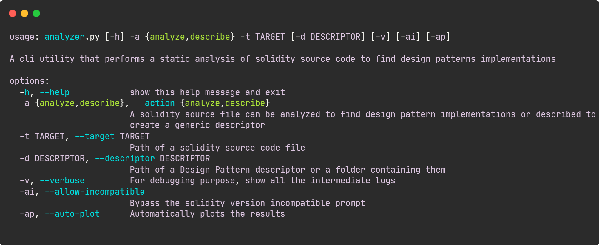

<a name="readme-top"></a>

<br />
<div align="center">
  <a href="https://github.com/LightDestory/SolidityDesignPatternAnalyzer">
    
  </a>
<h3 align="center">Solidity Design Pattern Analyzer</h3>

  <p align="center">
    Un utility per il riconoscimento di design pattern su blockchain tramite analisi statica del codice
    <br />
    <br />
    This README is available in the following languages:
    <br />
    Italian
    ·
    <a href="README.en.md">English</a>
</div>

<details>
  <summary>Tabella dei Contenuti</summary>
  <ol>
    <li>
      <a href="#informazioni-sul-progetto">Informazioni sul Progetto</a>
      <ul>
        <li><a href="#basato-su">Basato su</a></li>
      </ul>
    </li>
    <li>
      <a href="#guida-allutilizzo">Guida all'utilizzo</a>
      <ul>
        <li><a href="#prerequisiti">Prerequisiti</a></li>
        <li><a href="#come-usarlo">Come usarlo</a></li>
      </ul>
    </li>
    <li><a href="#licenza">Licenza</a></li>
    <li><a href="#bibliografia">Bibliografia</a></li>
  </ol>
</details>


## Informazioni sul Progetto

Solidity Design Pattern Analyzer è un applicativo software sviluppato per la mia tesi di laurea per il CdL Triennale in Informatica presso l'Università degli Studi di Catania.

L’applicativo software e in grado di eseguire le seguenti operazioni:
- Rilevare, nei limiti linguistici e delle dipendenze utilizzate, tutti e ventidue i design pattern documentati nella tesi, i cui relativi descriptor sono inclusi nel codice sorgente, ed e possibile, mediante la combinazione di controlli generici, definire nuovi descriptor per riconoscere design pattern futuri;
- Descrivere uno smart-contract, ovvero estrarre le informazioni utili a creare un
nuovo descriptor;

<p align="right">(<a href="#readme-top">back to top</a>)</p>


### Basato su

* [Python](https://www.python.org/)
* [python-solidity-parser](https://github.com/ConsenSys/python-solidity-parser)
* [python-jsonschema](https://github.com/python-jsonschema/jsonschema)
* [matplotlib](https://github.com/matplotlib/matplotlib)

<p align="right">(<a href="#readme-top">back to top</a>)</p>


## Guida all'utilizzo

Prima di utilizzare l'applicativo è necessario installare le dipendenze.

### Prerequisiti

Per installare le dipendeze puoi usare il package installer di python denominato _pip_:
* Come pacchetti globali:
  ```sh
  pip install -r requirements.txt
  ```
* Tramite ambiente virtuale:
  ```sh
  python3 -m venv /path/to/new/virtual/environment
  source /path/to/new/virtual/environment/bin/activate
  pip install -r requirements.txt
  ```

### Come usarlo

Per utilizzare Analyzer e necessario fornire una serie di parametri, qui elencati:
| Parametro | Descrizione |
| --------- | ---------------------------------------------------------------------------------------------- |
|`-h, --help` | Un parametro opzionale che, se fornito, fara stampare una guida sull’utilizzo nel terminale |
|`-a, --action` | Un parametro obbligatorio che accetta soltanto i valori ”analyze” e ”describe”, a seconda dell’operazione che si vuole eseguire. |
|`-t, --target` | Un parametro obbligatorio che rappresenta la path, assoluta o relativa, del file contenente del codice sorgente Solidity. |
|`-d, --descriptor` | Un parametro obbligatorio per l’operazione ”analyze” che rappresenta la path, assoluta o relativa, del file o cartella contenente i ”Design Pattern Descriptor”. Se omesso verrà usato un path predefinito. |
|`-v, --verbose` | Un parametro opzionale che, se fornito, fara stampare nel terminale i log di debug, normalmente non visualizzati. |
|`-ai, --allow-incompatible` | Un parametro opzionale che, se fornito, fara ignorare il controllo di compatibilita della versione di Solidity utilizzata nel file fornito. |
|`-ap, --auto-plot` | Un parametro opzionale che, se fornito, fara visualizzare automaticamente il grafico dei risultati della ricerca dei design pattern. |

Per esempio, volendo analizzare uno smart-contract al fine di individuare l’utilizzo dell’Ownership pattern e necessario eseguire il comando:

  ```sh
  python analyzer.py -a analyze -t ./source_code.sol -d ./Ownership_descriptor.json
  ```

<p align="right">(<a href="#readme-top">back to top</a>)</p>


## Licenza

Il software è rilasciato sotto licenza MIT. Visionare `LICENSE` per maggiori informazioni.

<p align="right">(<a href="#readme-top">back to top</a>)</p>


## Bibliografia

- [What is Ethereum?](https://ethereum.org/it/what-is-ethereum/)
- [Solidity Documentation.](https://docs.soliditylang.org/)
- [The official home of the Python Programming Language.](https://www.python.org/)
- [ANother Tool for Language Recognition.](https://www.antlr.org/)
- [An experimental Solidity parser for Python built on top of a robust ANTLR4 grammar.](https://github.com/ConsenSys/ python-solidity-parser)
- [JSON Schema — The home of JSON Schema.](https://json- schema.org/)
- [JSON Schema Draft-07 Release Notes.](https://json- schema.org/draft-07/json-schema-release-notes.html)
- [An implementation of the JSON Schema specification for Python.](https://github.com/python-jsonschema/jsonschema)
- M. Wohrer e U. Zdun. “From Domain-Specific Language to Code: Smart Contracts and the Application of Design Patterns”. In: IEEE Software 37.05 (set. 2020), pp. 37–1.  issn: 1937-4194. doi: 10.1109/- MS.2020.2993470
- Lodovica Marchesi et al. “Design Patterns for Gas Optimization in Ethereum”. In: 2020 IEEE International Workshop on Blockchain Oriented Software Engineering (IWBOSE).Feb.2020, pp.9–15.doi:10.- 1109/IWBOSE50093. 2020.9050163
- [Smart Contracts Design Patterns in the Ethereum Ecosystem and Solidity Code.](https://github.com/maxwoe/solidity_patterns)
- [Smart-Contract Patterns written in Solidity, collated for community good.](https://github.com/cjgdev/smart-contract-patterns)
- [A compilation of patterns and best practices for the smart contract programming language Solidity.](https://github.com/fravoll/solidity-patterns)
- Maximilian Wohrer e Uwe Zdun. “Smart contracts: security patterns in the ethereum ecosystem and solidity”. In: 2018 International Workshop on Blockchain Oriented Software Engineering (IWBOSE). - Mar. 2018, pp.2–8.doi: 10.1109/IWBOSE.2018.8327565
- [OpenZeppelin Contracts is a library for secure smart contract development.](https://github.com/OpenZeppelin/openzeppelin-contracts)

<p align="right">(<a href="#readme-top">back to top</a>)</p>
